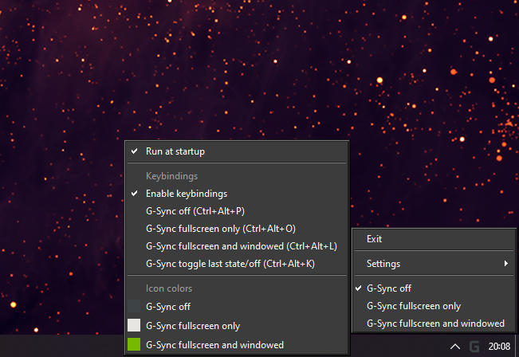

# systray-gsync-toggle

G-Sync mode switching application that lives in the system tray. 

🔄 Allows easy switching between:
  - G-Sync off
  - G-Sync fullscreen only
  - G-Sync fullscreen and windowed

⌨ Supports remapping keybindings in the settings menu:
  - Toggle between last G-Sync mode and G-Sync off
  - G-Sync off
  - G-Sync fullscreen only
  - G-Sync fullscreen and windowed

🎨 Supports custom icon colors for each G-Sync mode:
  - G-Sync off
  - G-Sync fullscreen only
  - G-Sync fullscreen and windowed

## Installation

Download the latest release from the [releases page](https://github.com/seaspaceman/systray-gsync-toggle/releases). Extract the archive. Run `systray-gsync-toggle.exe`.

## Contributors

This project is a fork of the command line utility [gsync-toggle](https://github.com/FrogTheFrog/gsync-toggle) for switching G-Sync modes.

If you experience any problems, please open an [issue](https://github.com/seaspaceman/systray-gsync-toggle/issues) or submit a [pull request](https://github.com/seaspaceman/systray-gsync-toggle/pulls).

## License

This project is licensed under the GNU General Public License v3.0 (GPL-3.0)

## Included Libraries and Their Licenses

- **gsync-toggle**: GNU General Public License v3.0
- **nvapi-wrapper**: GNU General Public License v3.0
- **nvapi**: MIT License
- **Qt**: GNU Lesser General Public License v3.0
